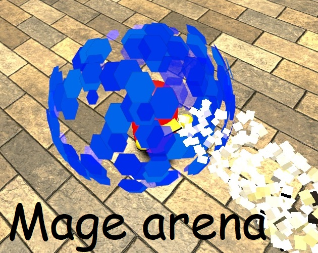
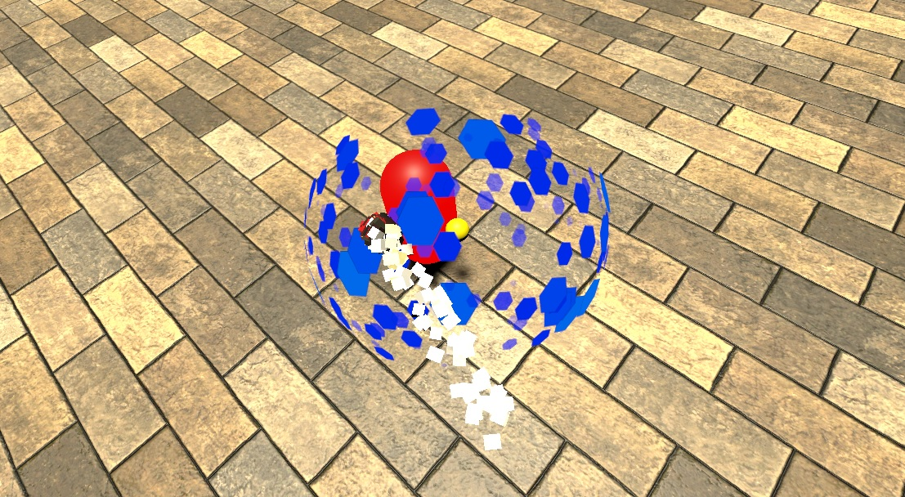
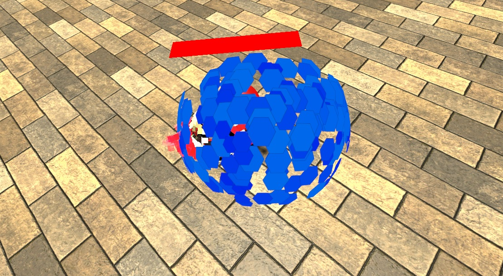
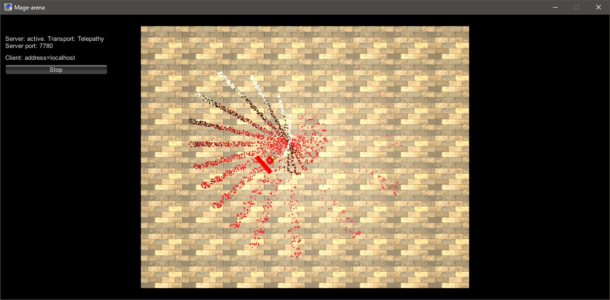

# Mage arena
Made in two days for hackathon by DTF and Playgendary  
Fast multiplayer pvp-arena

# Downloads and Links
Available only for [Windows](https://teamon.itch.io/mage-arena). If you encounter any problem, please leave a issue! 

# Controls
 * WASD for moving
 * Click LMB to shoot fireball. Hold to charge
 * Hold RMD to raise particle shield 

# Credits
 * [Team-on](https://github.com/Team-on) - programmer

# Screenshots
  
  
 
